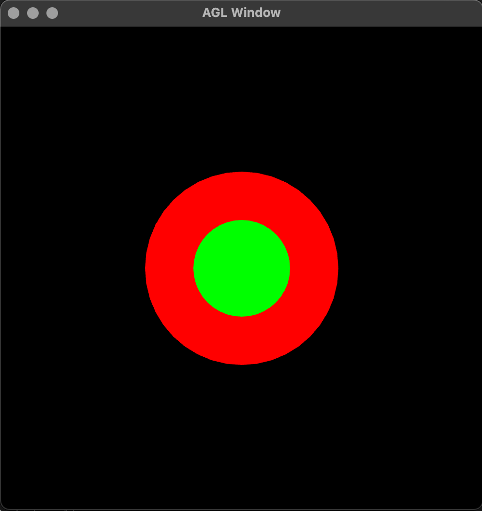
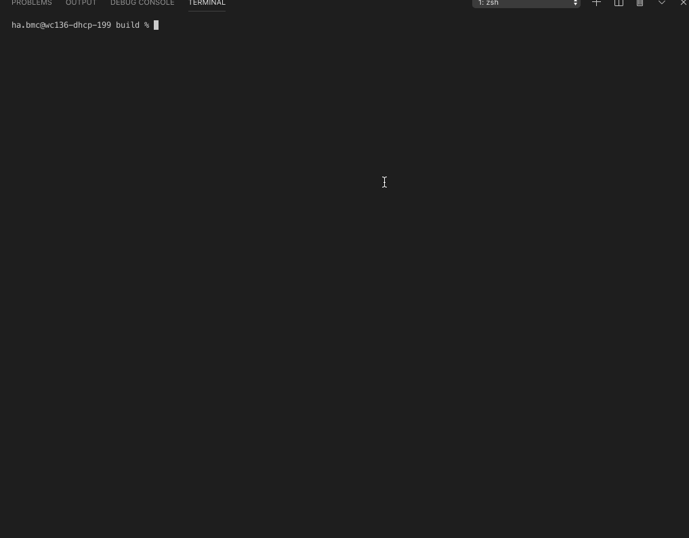

<<<<<<< HEAD
# Readme

## Sphere2D
A red sphere behind a green sphere

## Sphere3D
Gif demonstrating moving a sphere in random directions with SpaceBar and resetting its location with R key

Video demonstrating moving a sphere in random directions with SpaceBar and resetting its location with R key

https://user-images.githubusercontent.com/44280407/132627584-2d63d1bf-ad19-4b15-971e-3eb1182f4581.mov
=======
# Readme

## Sphere2D

TODO: Replace this text with results

* images, gifs, videos
* brief description of what each image/gif/video shows

## Sphere3D

TODO: Replace this text with results

* images, gifs, videos
* brief description of what each image/gif/video shows
>>>>>>> upstream/main
