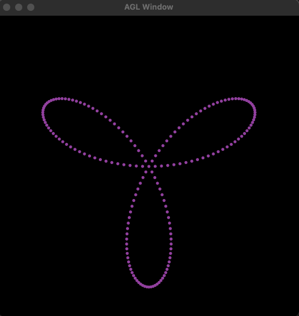

# Readme

## Assignment 1

### Part 1
Animation of the two eyes

### Part 2
Eyes following a target

### Part 3
Particles moving in a straight line

### Part 4
Particles moving in concentric circles

### Part 5
Rose curves with different numbers of petals

