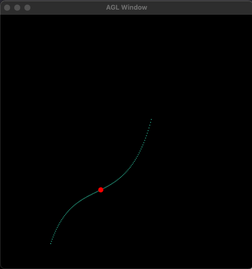

# Readme

## Assignment 2

### Part 1
A color gradient that uses linear interpolation to gradually change from one color to another based on position.

### Part 2
An application that draws a cubic curve (and its control points) using both Bernstein polynomials and De Casteljau’s algorithm.

### Part 3
Animates the position of a particle based on a cubic polynomial.

### Part 4
A series of random curves and use linear interpolation between the control points to blend from one curve to the next.

### Part 5
Degree 4 Bezier curve with 3 middle control points specified by users with mouse click

